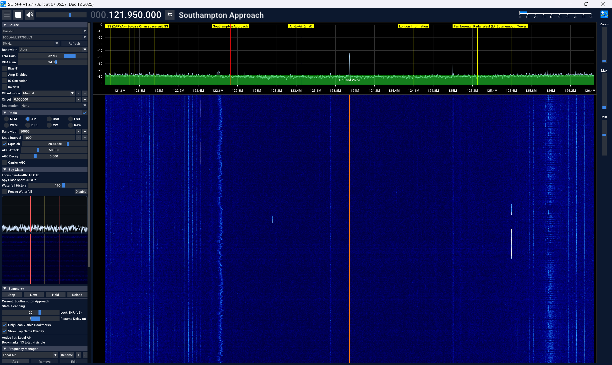
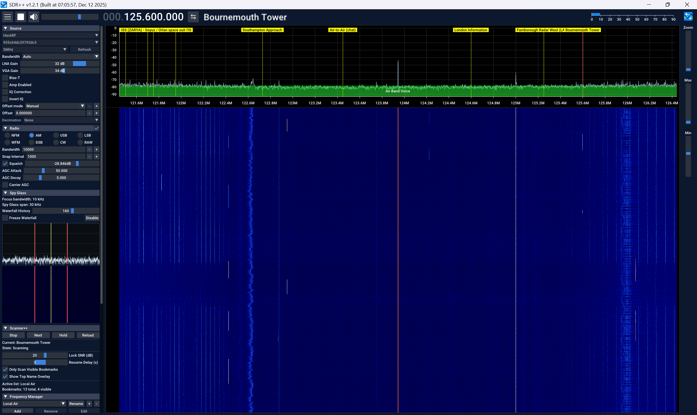

# BM Scanner

`BM Scanner` is an SDR++ Bookmark Scanner plugin that scans bookmarks from the active Frequency Manager list.

## Screenshots

Scanner workflow / controls:



Scanner active scan state:



## Features

Current behavior:

- Reads bookmark `name`, `frequency`, and `bandwidth` from the active Frequency Manager list.
- Scans bookmarks in ascending frequency order.
- Uses fixed dwell sampling per step (`100 ms`).
- Locks when SNR is above `Lock SNR (dB)` threshold.
- Unlock hysteresis and delayed resume with `Resume Delay (s)` slider (`0..5`).
- Supports `Scan/Stop`, `Next`, `Hold/Unhold`, and `Reload` controls.
- Optional `Only Scan Visible Bookmarks` mode.
- Displays current bookmark/state and active list counts (`total`, `visible`).
- Optional top-bar bookmark name overlay while scanning.
- Stops scanning automatically if receiver playback stops.

## Install

Copy `bm_scanner.dll` into your SDR++ `modules` folder and restart SDR++.

Typical Windows example:

- `sdrpp_windows_x64\modules\bm_scanner.dll`

## Activate In SDR++

After copying the DLL into the `modules` folder:

1. Start or restart SDR++.
2. Open the left-side menu.
3. Look for `BM Scanner` in the module list.

If it does not appear automatically:

1. Open `Module Manager`.
2. Add a new module instance.
3. Set `Name` to `BM Scanner`.
4. Set `Type` to `bm_scanner`.
5. Enable the module.

## Build

Run:

```bat
build-bm-scanner.bat
```

Expected result:

- `bm_scanner.dll`

## Notes

- This module does not require Spy Glass to run.
- BM Scanner and Spy Glass are independent modules.
- Tested against Windows SDR++ environments compatible with the included build script.
